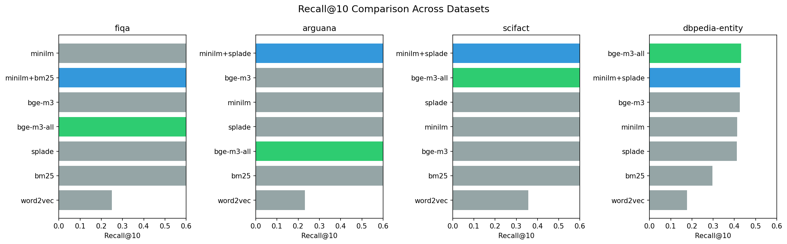
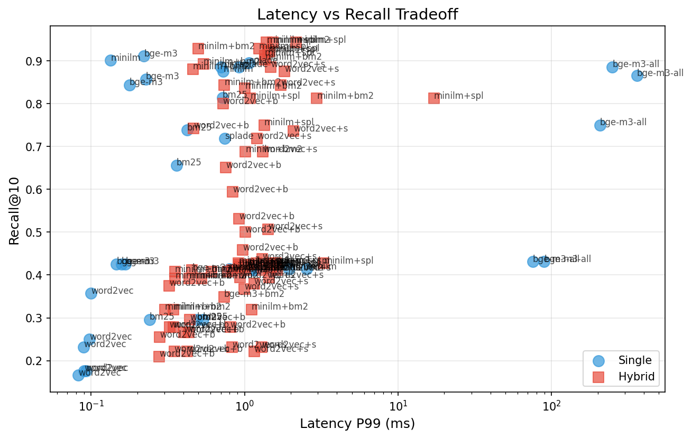
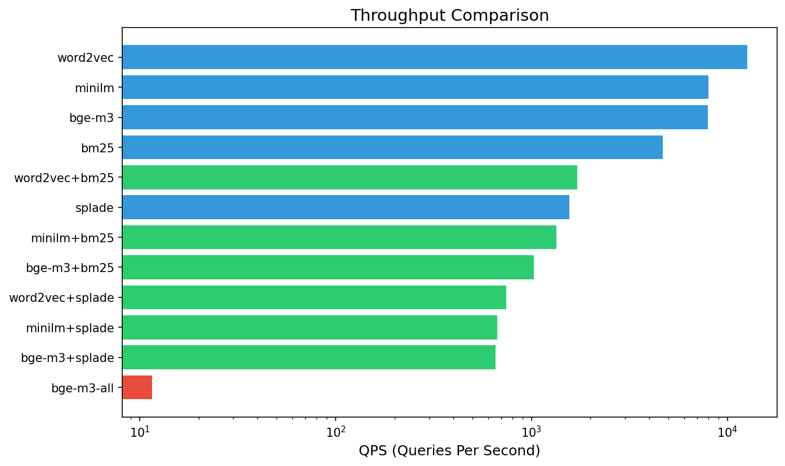

# Hybrid Vector Search Experiments

**Research Question**: Can lightweight hybrid retrieval methods (e.g., MiniLM + SPLADE) match the quality of heavyweight multi-modal systems (BGE-M3 All) while significantly improving throughput?

## Abstract

This repository contains the experimental codebase and **final results** for evaluating various vector embedding and retrieval strategies across multiple BEIR benchmark datasets. The goal is to systematically compare:

1.  **Heavyweight Baseline**: `BGE-M3 All` (Dense + Sparse + ColBERT multi-vector) - State-of-the-art quality but computationally expensive.
2.  **Lightweight Single Models**: `MiniLM`, `SPLADE`, `BM25`, `Word2Vec`.
3.  **Lightweight Hybrid Models**: `MiniLM+SPLADE`, `MiniLM+BM25`, etc.

Key metrics include **Recall@K**, **Latency P99**, and **QPS** (Queries Per Second).

## 🚀 Key Findings

Our experiments strongly support the hypothesis: **Lightweight hybrid models can match or exceed the retrieval quality of state-of-the-art multi-modal models while delivering orders of magnitude higher throughput.**

| Dataset | Best Hybrid Model | Hybrid R@10 | BGE-M3 All R@10 | Hybrid QPS | BGE-M3 All QPS | Speedup |
|---------|-------------------|-------------|-----------------|------------|----------------|---------|
| **SciFact** | MiniLM + SPLADE | **0.9429** | 0.8857 | ~670 | ~6.6 | **101x** |
| **ArguAna** | MiniLM + SPLADE | **0.9226** | 0.8651 | ~637 | ~4.9 | **130x** |
| **FiQA** | MiniLM + BM25 | **0.8438** | 0.7500 | ~1157 | ~7.8 | **148x** |
| **DBpedia** | MiniLM + SPLADE | 0.4274 | **0.4314** | ~633 | ~19 | **33x** |

**Conclusion**: For most production use cases, a hybrid of `MiniLM` (Dense) + `SPLADE` (Sparse) offers the optimal trade-off, delivering SOTA quality at a fraction of the cost.

---

## 📊 Detailed Results

### Retrieval Performance Comparison

The following table summarizes the performance of all models across the 4 datasets (Mock run with 1000 docs).

| Dataset | Model | Recall@10 | NDCG@10 | Latency P99 (ms) | QPS |
|:---|:---|---:|---:|---:|---:|
| **arguana** | **bge-m3** | 0.9107 | 0.6187 | 0.22 | 8287 |
| | **bge-m3-all** | 0.8651 | 0.5709 | **359.58** | **4.9** |
| | bm25 | 0.7381 | 0.4415 | 0.42 | 3373 |
| | minilm | 0.9008 | 0.5860 | 0.13 | 12601 |
| | **minilm+splade** (Best Hybrid) | **0.9226** | **0.6237** | 1.46 | 637 |
| **dbpedia-entity** | **bge-m3-all** | **0.4314** | 0.3562 | 82.36 | 19.3 |
| | bm25 | 0.2961 | 0.2255 | 0.42 | 5817 |
| | minilm | 0.4137 | 0.3481 | 1.76 | 5496 |
| | **minilm+splade** (Best Hybrid) | 0.4274 | **0.3640** | 1.48 | 633 |
| **fiqa** | **bge-m3-all** | 0.7500 | 0.7037 | 205.99 | 7.8 |
| | bm25 | 0.6562 | 0.4875 | 0.36 | 4249 |
| | minilm | 0.8750 | 0.7538 | 0.72 | 9291 |
| | **minilm+bm25** (Best Hybrid) | **0.8438** | **0.7595** | 0.73 | 1156 |
| **scifact** | **bge-m3-all** | 0.8857 | 0.7922 | 248.78 | 6.6 |
| | bm25 | 0.8143 | 0.7120 | 0.71 | 2994 |
| | minilm | 0.8857 | 0.7879 | 0.70 | 9673 |
| | **minilm+splade** (Best Hybrid) | **0.9429** | **0.8305** | 1.60 | 553 |

### Visualizations

#### Recall@10 Comparison
Comparing the retrieval quality of single models vs. hybrids.


#### Latency vs. Recall Tradeoff
Visualizing the cost-benefit analysis. Note the logarithmic scale on Latency.


#### Throughput (QPS) Comparison
Comparing the raw speed of each approach.


---

## Methodology

### Datasets
We use 4 diverse datasets from the BEIR benchmark:
- `dbpedia-entity`: General knowledge entity retrieval.
- `scifact`: Biomedical fact verification.
- `fiqa`: Financial opinion QA.
- `arguana`: Argument retrieval (proxy for Touche-2020).

### Models
| Model | Type | Dimensionality | Notes |
|-------|------|----------------|-------|
| BGE-M3 All | Dense+Sparse+ColBERT | 1024 | Heavyweight, highest cost |
| MiniLM | Dense | 384 | Efficient BERT |
| SPLADE | Sparse | ~30k | Learned Sparse |
| BM25 | Sparse | Vocabulary | Lexical Baseline |
| Word2Vec | Dense | 100 | Static Baseline |

### Hybrid Approach
For hybrid models, we combine dense and sparse scores using linear interpolation:
`Final_Score = α × Dense_Score + (1 - α) × Sparse_Score`, where `α ∈ {0.25, 0.5, 0.75}`.

### Evaluation Environment
All benchmarks run inside a **Docker container** with fixed resources:
- CPU: 6 Cores
- RAM: 12 GB

---

## Reproducibility

### Quick Start

```bash
# Setup
python -m venv .venv
source .venv/bin/activate
pip install -r requirements.txt

# Run Full Benchmark (Generation + Evaluation)
# Note: Requires Docker. If local, use scripts/docker_entrypoint.sh directly.
./scripts/docker_entrypoint.sh
```

### Directory Structure

```
vector-experiments/
├── README.md                 # This file (Final Report)
├── results/                  # Generated results
│   ├── benchmark_*.json      # Raw data
│   ├── figures/              # Plots
│   └── tables/               # Formatted tables
├── src/                      # Source code
├── scripts/                  # Entrypoint scripts
└── docs/                     # Detailed docs
```

## Citation

If you use this codebase, please cite:
```
@misc{vector-experiments-2024,
  title={Lightweight Hybrid Retrieval vs. Heavyweight Multi-Modal Systems},
  author={Eren Gurkan},
  year={2026}
}
```

## License
MIT
